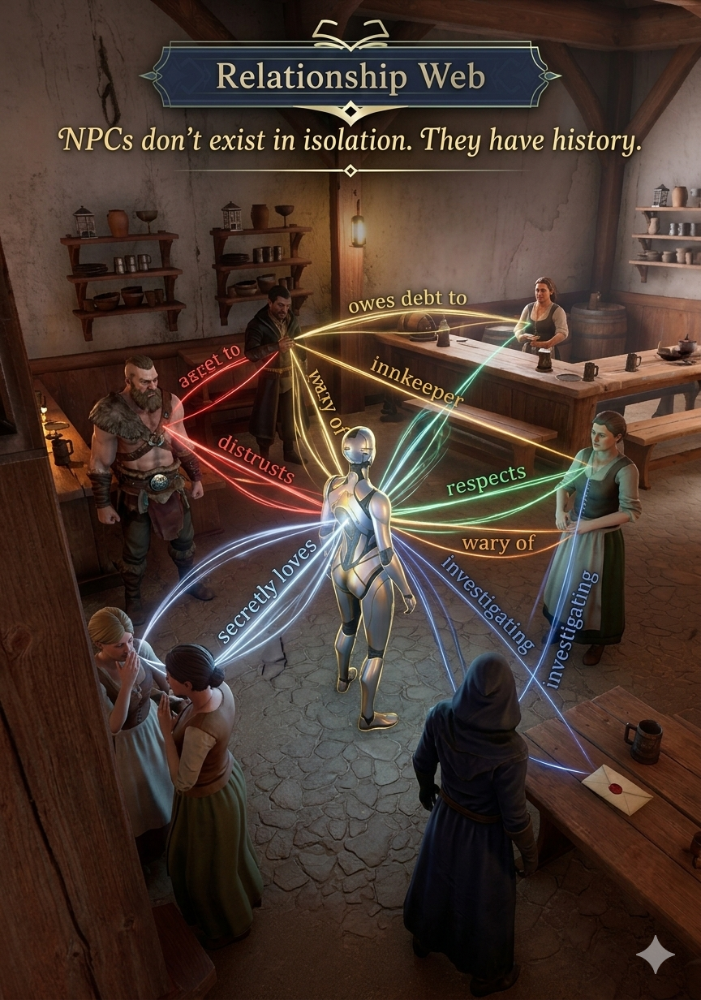
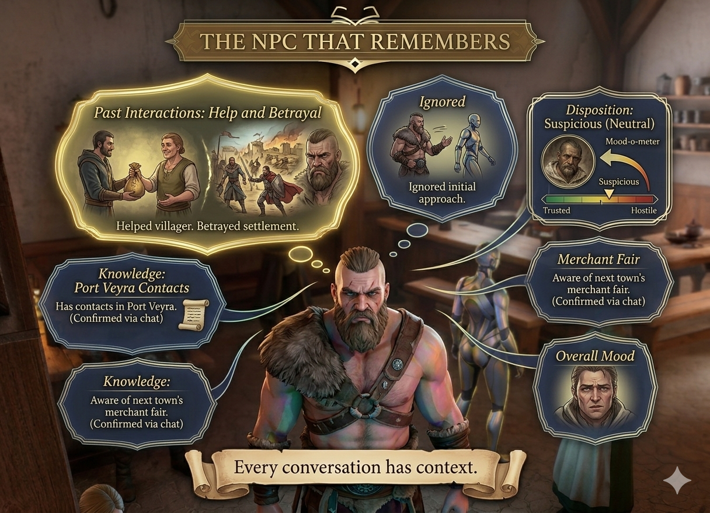
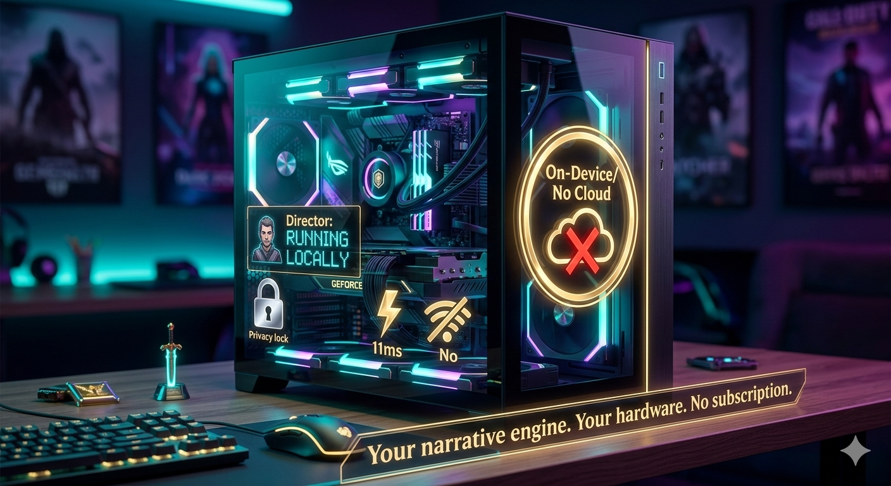
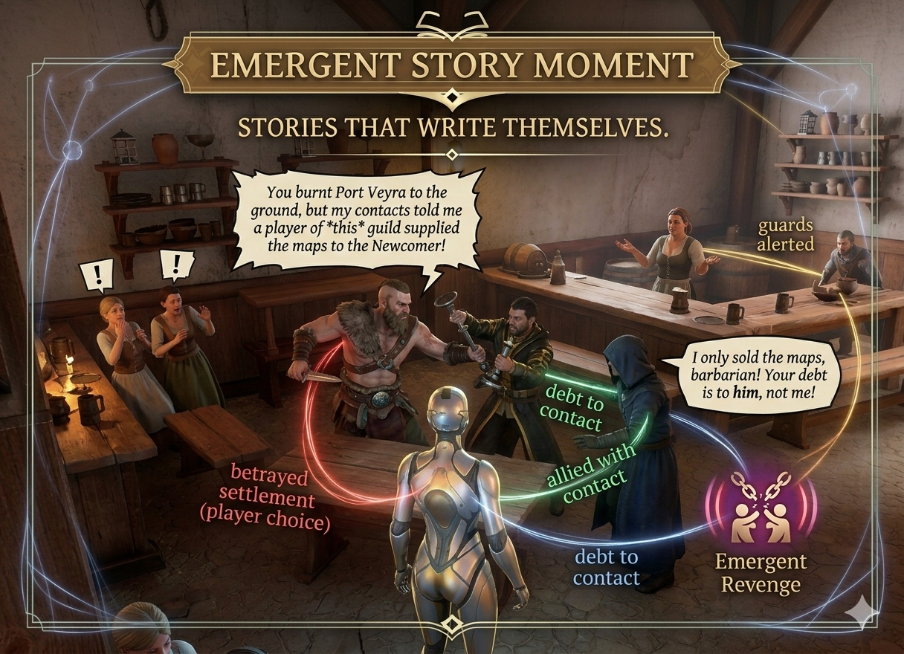

# LoreWeaver Newsletter — March 2026

**Building the Future of Narrative AI for Games**

---

Dear friends and supporters,

Q1 2026 has been our most productive quarter yet. While the industry debates whether AI belongs in games, we've been building — and now we have working systems to show for it.

---

## 🎮 Director: From Prototype to Alpha

**Director is now running end-to-end gameplay loops.**

This isn't a demo. Director is a fully operational narrative AI engine connected to Unreal Engine 5, making real-time decisions about dialogue, actions, plot progression, and character development.

### The Relationship Web

Director tracks every relationship between characters in real-time — not just "friendly" or "hostile," but semantic relationships like *"sold intelligence about"*, *"investigating"*, and *"secretly loves"*.

When you ask an NPC about another character, they don't recite a canned response. They know the history. They have opinions. They might lie.

### NPCs That Remember

Every conversation has context. NPCs track past interactions, their disposition toward the player, and what they know — then respond accordingly.

### On-Device, No Cloud

- **11.86ms** response latency
- Runs on consumer GPUs (4GB VRAM)
- No cloud dependency, no per-token API costs
- Works offline — critical for shipped games

---

## ✍️ Architect: v0.3.2 Released

Architect continues to mature as a production tool for narrative designers.

**New this quarter:**
- Entity generation from examples
- Visual Story Board with infinite canvas
- LLM task queue with progress tracking
- Schema propagation for field changes

---

## 📊 By The Numbers

| Metric | Value |
|--------|-------|
| Director latency | 11.86ms |
| Intent classification | 92.3% |
| Character voice fidelity | 96% |
| Lore retrieval (P50) | 58ms |
| Qualitative score | 8.58/10 |

---

## 🎯 What's Next

**March 2026**
- Director UE5 demo showcase (~2 weeks)
- B'Game presentation (March 19)
- Begin studio outreach campaign

**April 2026**
- EUR 150K SAFE closing
- Director pilot program launch

**Q4 2026**
- EUR 400K equity round
- Director commercial release

---

## 🤝 How You Can Help

**Investors:** Intros to gaming VCs (BITKRAFT, Konvoy, Hiro Capital)

**Studios:** If you're building narrative-heavy games, let's talk about piloting Director.

**Industry contacts:** Introductions to narrative directors at AA+ studios.

---

## 💬 One More Thing

*"Aren't you worried about the AI backlash in games?"*

No. The backlash is against lazy AI replacing human creativity. That's not what we're building.

Director doesn't write your story. It **runs** your story in real-time, making thousands of small decisions that used to require massive scripting budgets.

**Stories that write themselves.**

---

Thanks for being part of the journey.

**Rijk Groenewoud**
Founder & CEO, LoreWeaver

[LinkedIn](https://linkedin.com/in/rijkgroenewoud) | [Website](https://loreweaver.ink) | [Email](mailto:rijk@loreweaver.ink)
